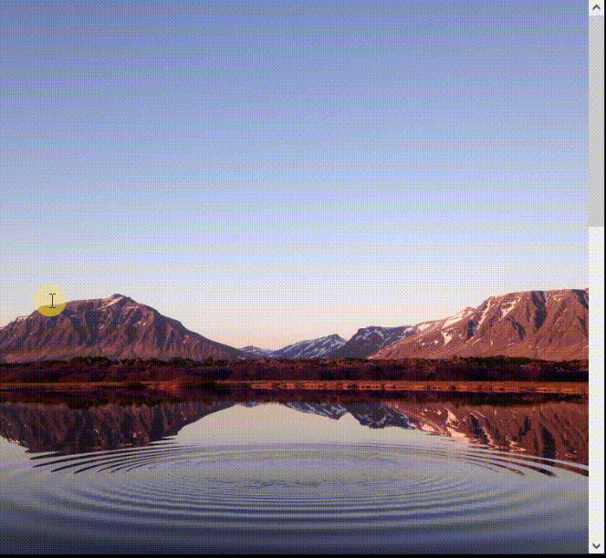

# React - parallax effect

# 🔗 [Live Preview](https://adorable-pie-1639a5.netlify.app/)

---
## About 👋

Just a simple daily practice project that explores the usage of parallax effect and also coming back to React after practicing Next.js for a while, its good to switch back a forth and familiarize with React structure and commands again. I followed along this video (https://youtu.be/29UWA-GdA7k?si=Nlf-Pns1WECM9TS6) to apply this method of parallax

---

## Languages used 👨‍💻 

* React 
* Tailwind: for styling
* Framer motion